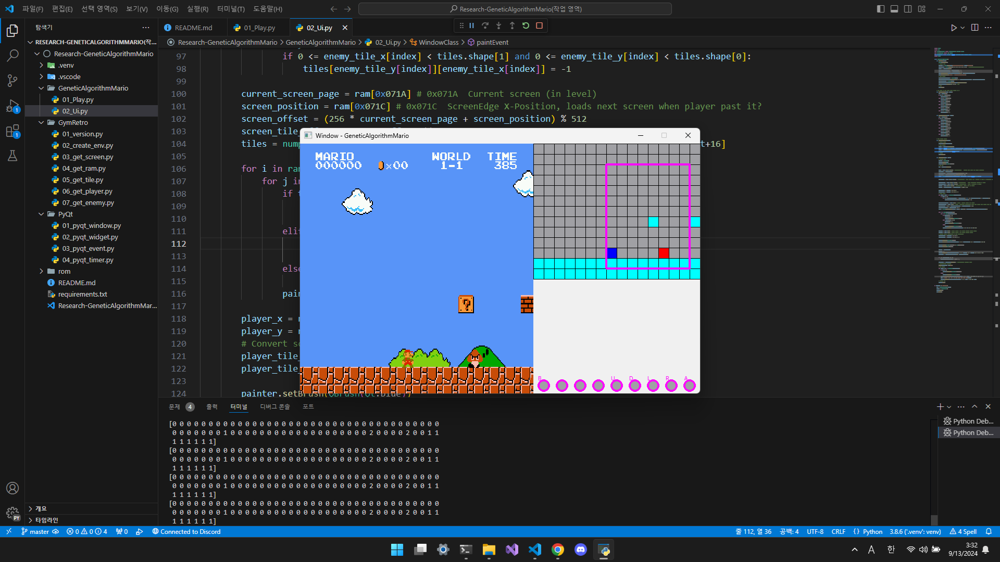

# 💻 Research-GeneticAlgorithmMario

## Preview



- ## Introduction

    > Python [Gym-retro](https://pypi.org/project/gym-retro/)을 사용하여 유전 알고리즘을 통해 게임 마리오 학습 시키기  

- ## Requirements  

    > Python version : 3.8.6  
    ```cmd
    pip install PyQt5
    pip install numpy
    pip install gym-retro
    pip install gym==0.25.2
    ```
    > [슈퍼 마리오 ROM 파일 다운로드]  
    > .nes파일의 저작권 문제로  
    > **Super Mario Bros. (World).nes**파일을 외부에서 따로 찾아 넣어줘야 함  
    > 파일 다운로드 후 **./rom** 폴더에 저장. 프로젝트 최상위 폴더에서 아래 명령어 실행  
    ```cmd
    python -m retro.import ./rom
    ```

- ## .nes

    > [Super Mario Bros./RAM map](https://datacrystal.tcrf.net/wiki/Super_Mario_Bros./RAM_map)  
    > 

- ## Note

    ```cmd
    pip freeze > requirements.txt
    pip install -r requirements.txt
    ```
